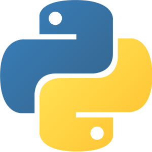
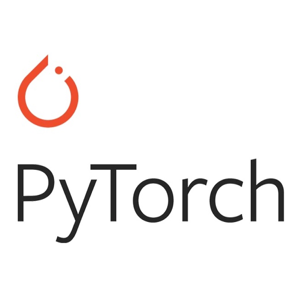
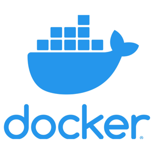

## 👋 Hi there, I'm Rajwinder

## 😄 NOW

- 🌱 Learning all about **Open Source**

## 👀 I'm interested in

- <code></code>
&nbsp;&nbsp;<code></code>
&nbsp;&nbsp;<code></code>

- <code></code>
&nbsp;&nbsp;<code></code>
&nbsp;&nbsp;<code></code>

- <code></code>
&nbsp;&nbsp;<code></code>

- <code></code>
